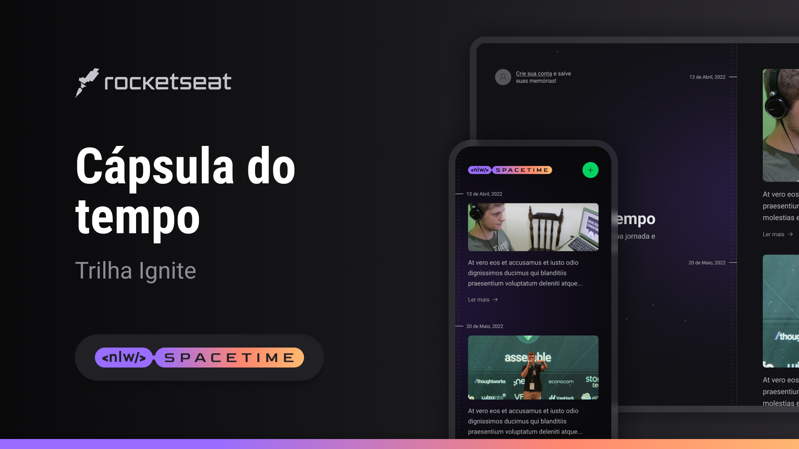

<p align="center">
 
</p>

<div align="center">

[](sdf)
[](LICENSE.md)
<a href="https://rocketseat.com.br">

</a>

</div>

---

## 📱 Sobre o projeto

<p>O projeto é uma aplicação full-stack, do back-end ao mobile, que funcionará como uma cápsula do tempo guardando memórias passadas numa timeline. </p>

---

## ⚙️ Funcionalidades

- [Expo](https://expo.io/)
- [Axios](https://axios-http.com/)
- [Node.js](https://nodejs.org/en/)
- [Prisma](https://www.prisma.io/)
- [SQLite](https://www.sqlite.org/index.html)
- [Fastify](https://www.fastify.io/)
- [Zod](https://zod.dev/)
- [dayjs](https://day.js.org/)
- [React](https://pt-br.reactjs.org/)
- [Next.js](https://nextjs.org/)
- [React Native](https://reactnative.dev/)
- [React Navigation](https://reactnavigation.org/)
- [TypeScript](https://www.typescriptlang.org/)
- [Tailwind CSS](https://tailwindcss.com/)

## 🚀 Recomendações

## Server

Para iniciar o servidor, entre na pasta `server` e rode o comando para instalar as dependências:

```bash
npm i
```

Para criar o banco de dados:

```bash
npx prisma migrate dev
```

Para iniciar o servidor:

```bash
npm run dev
```

## Web

Para rodar o projeto web, entre na pasta `web` e rode o comando para instalar as dependências:

```bash
npm i
```

Agora para iniciar o projeto, rode o comando:

```bash
npm run dev
```

## Mobile

Para rodar o projeto mobile você precisará baixar o app [Expo Go](https://expo.dev/client).
Após baixar o app, entre na pasta `mobile` e rode o comando para instalar as dependências:

```bash
npm i
```

Agora para iniciar o projeto, rode o comando:

```bash
npx expo start
```

---

## 🎉 Melhorias

- [ ] Responsivo;
- [ ] Página de edição da memória;
- [ ] Página de listagem da memória;

---

## 🎨 Layout

- [Figma](<https://www.figma.com/community/file/1240070456276424762/C%C3%A1psula-do-tempo-%E2%80%A2-Trilha-Ignite>)

## 📝 Licença

Este projeto esta sobe a licença [MIT](./LICENSE).

Feito pela Rocketseat.
